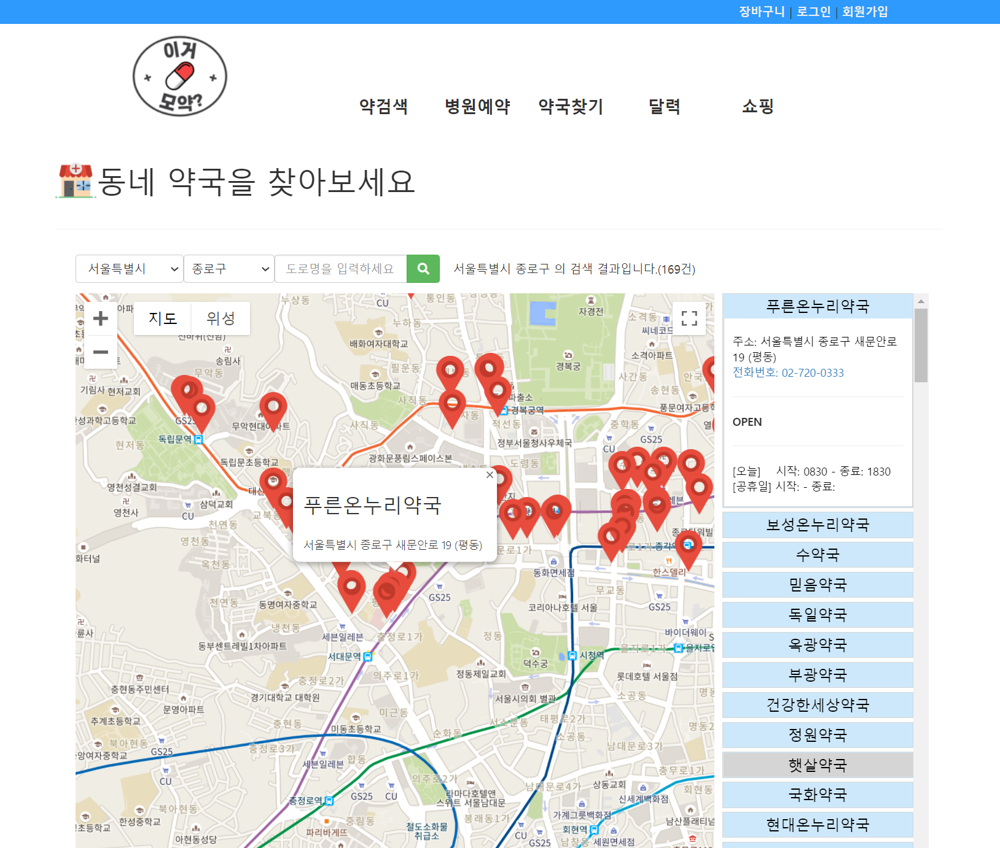
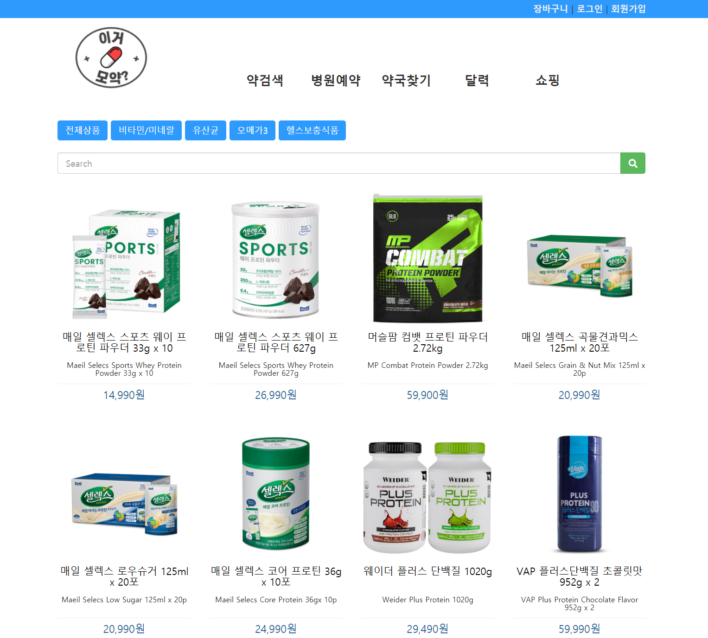

# 이거모약

###  1) 소개

의료 관련 정보 제공 및 영양제 판매를 서비스하는 웹사이트입니다.

###  2) 기간

20.06.22 ~ 20.10.08 

### 3) 팀원

5명

## 사이트 미리보기

http://itproject.ezenac.co.kr/wtm/

> 스크린샷은 이 페이지 맨 하단부에 있습니다.


## 설정 방법

### 1) 기본 준비

소스코드를 다운로드 받고 이클립스로 import 합니다.

### 2) 설정파일 준비

#### log4j.xml

> 프로젝트 안에 `log4j.sample.xml` 이라는 이름으로 샘플 파일이 포함되어 있습니다.

로그가 저장될 위치를 설정합니다.

아래의 코드에서 `자신의_workspace_경로`라고 된 부분을 자신의 경로에 맞춰 변경합니다.

```xml
<!-- 파일로 기록되는 로그 설정 -->
<appender name="rollingFile" class="org.apache.log4j.RollingFileAppender">
    <!-- 로그 파일 생성위치 -->
    <param name="file" value="자신의_workspace_경로/logs/web.log" />
    <param name="Append" value="true" />
    <!-- 로그 파일 하나당 사이즈 100m -->
    <param name="MaxFileSize" value="100mb" />
    <!-- 최대 생성 파일수 ( 50개가 넘으면 순차적으로 파일이 삭제됨 ) -->
    <param name="MaxBackupIndex" value="50" />
    <layout class="org.apache.log4j.PatternLayout">
        <param name="ConversionPattern" value="[%d{yyyy-MM-dd HH:mm:ss.SSS}][%-5p] %C{1}.%M(%F:%L) %m%n" />
    </layout>
</appender>

<!-- 날짜별 에러 로그 생성 -->
<appender name="errorFile" class="org.apache.log4j.DailyRollingFileAppender">
    <param name="Threshold" value="ERROR" />
    <param name="File" value="자신의_workspace_경로/logs/error.log" />
    <param name="Append" value="true" />
    <param name="DatePattern" value="'.'yyMMdd" />
    <layout class="org.apache.log4j.PatternLayout">
        <param name="ConversionPattern" value="[%d{yyyy-MM-dd HH:mm:ss.SSS}][%-5p] %C{1}.%M(%F:%L) %m%n" />
    </layout>
</appender>
```


#### root-context.xml

> 프로젝트 안에 `root-context.sample.xml` 이라는 이름으로 샘플 파일이 포함되어 있습니다.

아래의 부분을 찾아서 `자신의_workspace_경로`, `프로젝트이름`, `구글메일주소`, `구글앱비밀번호` 값을 설정합니다.

```xml
<util:properties id="config">
    <!-- 기본 인코딩 타입 -->
    <prop key="encType">UTF-8</prop>
    <!-- 업로드 디렉토리 -->
    <prop key="uploadDir">자신의_workspace_경로/upload</prop>
    <!-- 업로드 디렉토리에 대한 WebPath -->
    <prop key="uploadPath">/프로젝트이름/upload</prop>
    <!-- 최대 업로드 가능 용량 (-1인 경우 무제한) -->
    <prop key="uploadMaxFileSize">-1</prop>
    <!-- 기본 도메인(쿠키설정용) -->
    <prop key="domain">localhost</prop>
    <!-- 메일발송 서버 주소 -->
    <prop key="smtpHost">smtp.gmail.com</prop>
    <!-- 메일발송 서버 포트 -->
    <prop key="smtpPort">465</prop>
    <!-- 메일발송 서버 계정 -->
    <prop key="smtpUsername">구글메일주소</prop>
    <!-- 메일발송 서버 비밀번호 -->
    <prop key="smtpPassword">구글앱비밀번호</prop>
</util:properties>
```

또한 아래와 같이 명시된 부분을 찾아 DB 정보를 입력합니다.

```xml
<!-- DB연동에 필요한 환경설정 값 -->
<util:properties id="dbConfig">
    <!-- 데이터베이스 호스트 이름 -->
    <prop key="dbHost">210.89.190.154</prop>
    <!-- 데이터베이스 포트번호 -->
    <prop key="dbPort">3306</prop>
    <!-- 데이터베이스 이름 -->
    <prop key="dbName">wtm</prop>
    <!-- 데이터베이스 문자셋 -->
    <prop key="dbCharset">utf8</prop>
    <!-- 데이터베이스 계정명 -->
    <prop key="dbUsername">wtm</prop>
    <!-- 데이터베이스 비밀번호 -->
    <prop key="dbPassword">123qwe!@#</prop>
    <!-- Mapper 파일들이 위치할 '/src/main/resources' 하위의 경로 -->
    <prop key="mapperPath">/mappers/**/*Mapper.xml</prop>
</util:properties>
```

#### server.xml (톰켓 설정 파일)

##### GET,POST,PUT,DELETE 관련 설정을 추가

```xml
<Connector
    connectionTimeout="20000"
    parseBodyMethods="POST,PUT,DELETE,PATCH"
    port="8080"
    protocol="HTTP/1.1"
    redirectPort="8443" />
```

##### 업로드 디렉토리 설정

업로드 디렉토리가 서버에 노출될 경로를 설정합니다. 이 경로 정보는 `root-context.xml`에 명시한 정보와 일치해야 합니다.

```xml
<Context
    docBase="자신의_workspace_경로/upload"
    path="/프로젝트이름/upload"
    reloadable="true" />
```

-------------------




